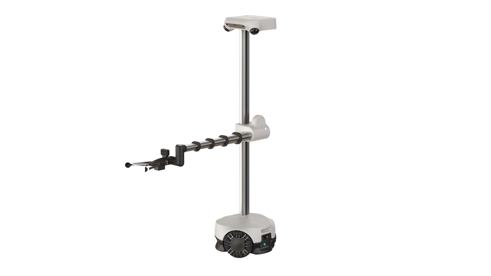

  
   
  <em> Hi, I am Stretch 4</em>

Welcome to the GitHub for **Hello Robot**.

Here you will find open-source code for the **Stretch 4** mobile manipulator as well as for the **Stretch 3** and older versions of the robot. 

---

## Stretch 4 Software Architecture

The Stretch 4 software ecosystem is organized into a multi-layered stack designed to transition seamlessly from low-level hardware control to high-level autonomous behaviors.

1. **Hardware & Drivers (The Foundation):** At the lowest level, `stretch4_body` and `stretch_firmware` handle direct communication with the robot's motors and sensors. This layer manages the 9-DOF movement, including the omnidirectional base, telescoping arm, and 3-axis wrist.
2. **Perception & Modeling:** To "see" the world, Stretch 4 utilizes specialized drivers like `stretch4_pyhesai_wrapper` for its dual 3D Lidars and `stretch4_rgbd` for enhanced depth sensing. The robot’s physical dimensions and kinematic constraints are defined in `stretch4_urdf`, which is essential for motion planning.
3. **Simulation:** Before deploying to physical hardware, the `stretch4_mujoco` stack allows developers to test algorithms in a high-fidelity physics environment.
4. **Middleware & Application (The Interface):** High-level control is primarily managed through `stretch4_ros2`, providing a standardized interface for navigation and manipulation. Interfaces like `stretch4_web_teleop` enable remote operation via a browser, while `stretch4_grasping_demo` showcases integrated AI capabilities using VLMs and visual servoing.

---

## Stretch 4 Public Repositories

The following table summarizes some of the key public repositories dedicated to the Stretch 4 platform.

| Repository | Description | Primary Language |
| --- | --- | --- |
| `stretch4_body` | Core Python SDK to interact with the Stretch 4 hardware and low-level joints. | Python |
| `stretch4_ros2` | The primary ROS 2 driver and package suite for autonomous operation. | Python |
| `stretch4_urdf` | Unified Robot Description Format (URDF) files for the Stretch 4 mobile manipulator. | Python/XML |
| `stretch4_mujoco` | Official simulation stack built on the MuJoCo physics engine. | Python |
| `stretch4_web_teleop` | Accessible, web-based interface for remote teleoperation. | TypeScript |
| `stretch4_grasping_demo` | AI-powered demo utilizing VLMs and object tracking for visual servoing. | Python |
| `stretch4_rgbd` | Methods to enhance and process RGB-D imagery from onboard cameras. | Python |
| `stretch4_pyhesai_wrapper` | Python wrapper for the Hesai JT128 3D hemispherical LiDARs. | C++ / Python |
| `stretch4_human_perception` | Specialized tools to enable the robot to perceive and track humans. | Python |
| `stretch4_compliant_gripper` | Modeling and control code for the standard Stretch 4 compliant gripper. | Python |

---

> **Note:** Stretch 4 is currently intended for research, development, and laboratory use. It has not yet been certified for FCC Class A compliance.

## Stretch 3 (and earlier) Public Repositories

The naming convention for Stretch 3 repositories typically follows a `stretch_*` or `stretch_re*` format, distinguishing them from the newer `stretch4_*` specific repos.

Significant repositories include

| Repository | Description |
| --- | --- |
| **stretch_ai** | High-level intelligence suite for grasping, navigation, and LLM agents. |
| **stretch_body** | The core Python SDK for interacting with RE1, RE2, and Stretch 3 hardware. |
| **stretch_ros2** | Official support for ROS 2 Humble, including Nav2 and teleop demos. |
| **stretch_firmware** | Arduino-based firmware for the robot's motor controllers and IMU boards. |
| **stretch_web_interface** | A redesigned browser-based interface for remote "manipulation from anywhere". |

